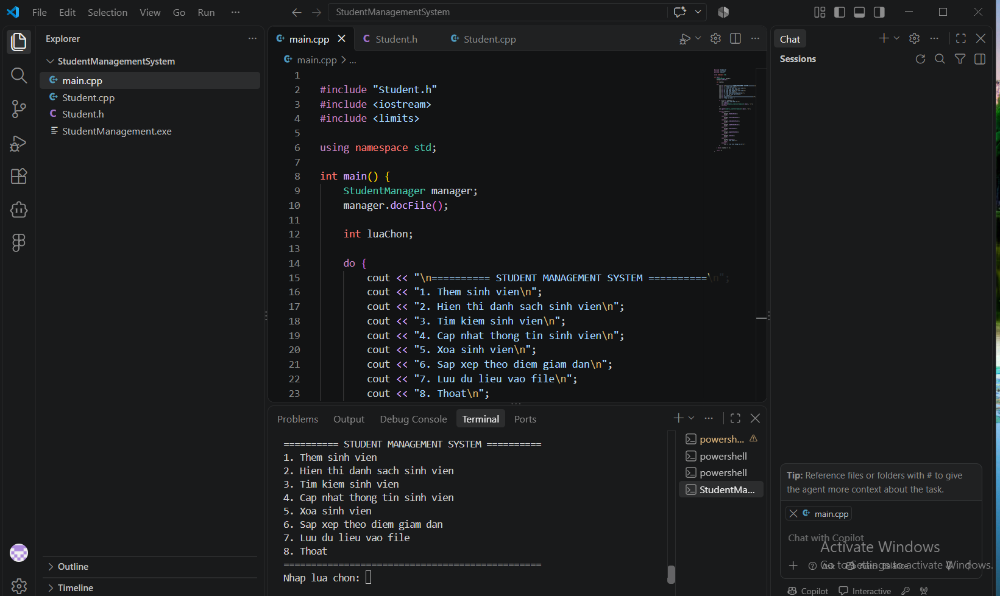
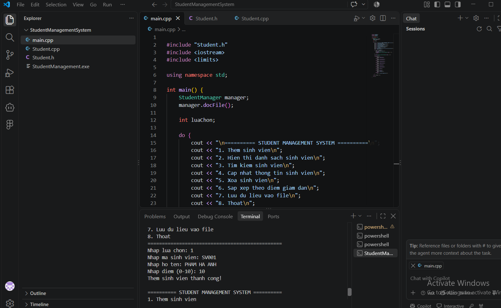
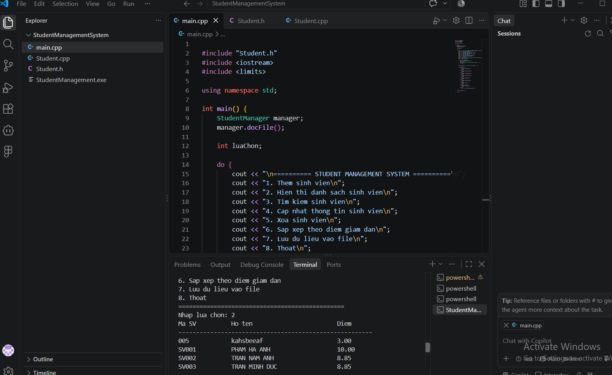
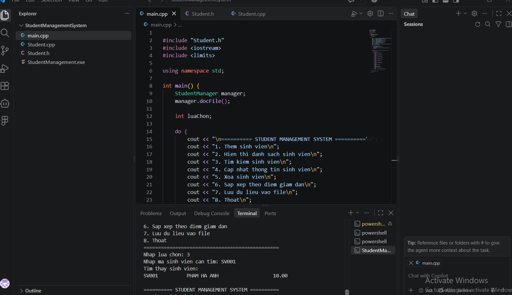
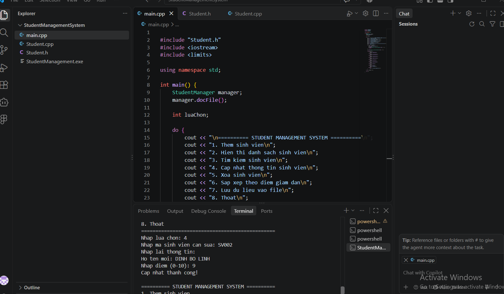
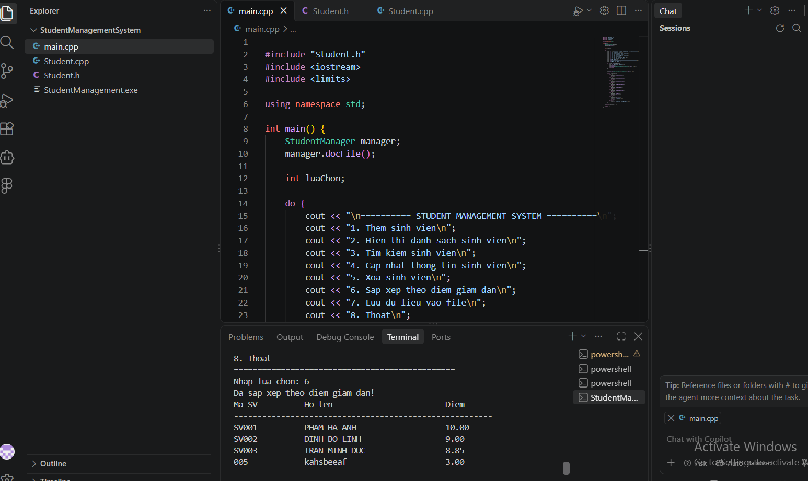

# Student Management System – C++

## Project Overview
A console-based Student Management System developed in C++ using Object-Oriented Programming (OOP).

This project demonstrates my understanding of C++ programming, class design, data management, and basic file handling.

## Features
- Add new students
- Display student information
- Search for students
- Update student information
- Delete student records
- Sort students by scores in descending order
- Save student data to a file
- Interactive console menu

## Technologies Used
- Programming Language: C++
- Programming Paradigm: Object-Oriented Programming (OOP)
- Development Environment: Visual Studio Code
- Compiler: GCC (g++)
- Version Control: GitHub

## Project Structure
- `main.cpp` – Main program and menu handling
- `Student.cpp` – Student class implementation
- `Student.h` – Student class declaration

## How to Run
Compile the project using GCC:

```bash
g++ main.cpp Student.cpp -o StudentManagement.exe
```

Run the program on Windows:

```powershell
.\StudentManagement.exe
```

## Learning Outcomes
Through this project, I practiced C++ programming, working with classes and objects, organizing code across multiple files, debugging, and implementing basic data management functionality.

## Future Improvements
- Improve input validation
- Add more advanced search and filtering
- Enhance data storage and error handling

## Author
C++ Developer | Computer Science Student

## Project Screenshots

### 1. Main Menu


### 2. Add Student


### 3. Student List


### 4. Search Student


### 5. Update Student


### 6. Sort Students by Score

  ## How to Run

### Requirements
- C++ compiler (G++)
- Visual Studio Code or another code editor

### Compile
```bash
g++ main.cpp Student.cpp -o StudentManagement.exe
```

### Run
On Windows PowerShell:
```powershell
.\StudentManagement.exe
```

### Usage
Select an option from 1 to 8 in the console menu to manage student records.
